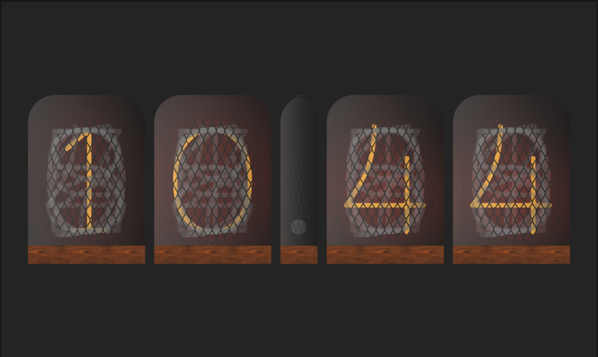

# Nixie Clock

Submission for the [Flutter clock challenge](https://flutter.dev/clock). It is a clock out of [nixie tubes](https://en.wikipedia.org/wiki/Nixie_tube).

<video src="/esarbanis/nixie_clock/raw/master/nixie_clock_showcase.mov" width="320" height="200" controls preload></video>
